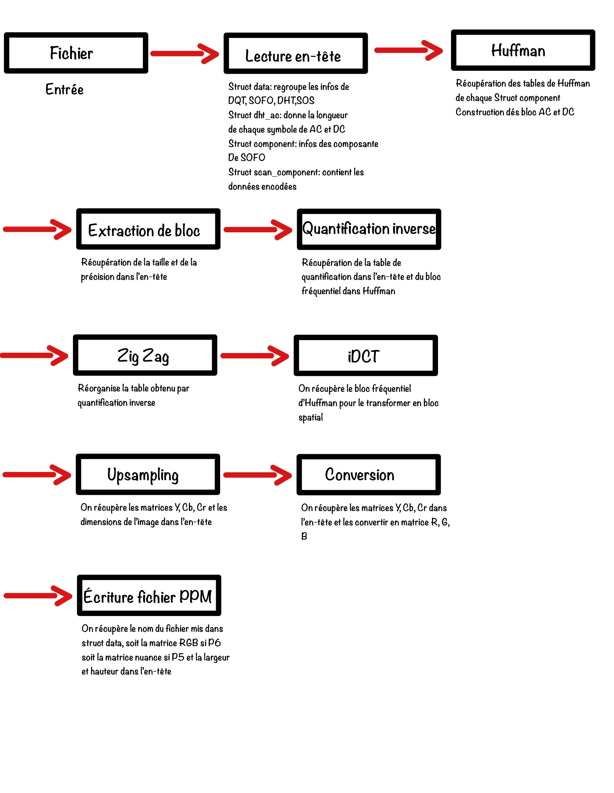

# Notre décodeur JPEG à nous

Bienvenue sur la page d'accueil de _votre_ projet JPEG, un grand espace de liberté, sous le regard bienveillant de vos enseignants préférés.
Le sujet sera disponible dès le mardi 2 mai à l'adresse suivante : [https://formationc.pages.ensimag.fr/projet/jpeg/jpeg/](https://formationc.pages.ensimag.fr/projet/jpeg/jpeg/).

Comme indiqué lors de l'amphi de présentation, vous devrez organiser un point d'étape avec vos enseignants pour valider cette architecture logicielle.
Cette page d'accueil servira de base à cette discussion. En pratique, vous pouvez reprendre son contenu comme bon vous semble, mais elle devra au moins comporter les infos suivantes :

1. des informations sur le découpage des fonctionnalités du projet en modules, en spécifiant les données en entrée et sortie de chaque étape ;
2. (au moins) un dessin des structures de données de votre projet (format libre, ça peut être une photo d'un dessin manuscrit par exemple) ;
3. une répartition des tâches au sein de votre équipe de développement, comportant une estimation du temps consacré à chacune d'elle (là encore, format libre, du truc cracra fait à la main, au joli Gantt chart).

Rajouter **régulièrement** des informations sur l'avancement de votre projet est aussi **une très bonne idée** (prendre 10 min tous les trois chaque matin pour résumer ce qui a été fait la veille, établir un plan d'action pour la journée qui commence et reporter tout ça ici, par exemple).

# Liens utiles

- Bien former ses messages de commits : [https://www.conventionalcommits.org/en/v1.0.0/](https://www.conventionalcommits.org/en/v1.0.0/) ;
- Problème relationnel au sein du groupe ? Contactez [Pascal](https://fr.wikipedia.org/wiki/Pascal,_le_grand_fr%C3%A8re) !
- Besoin de prendre l'air ? Le [Mont Rachais](https://fr.wikipedia.org/wiki/Mont_Rachais) est accessible à pieds depuis la salle E301 !
- Un peu juste sur le projet à quelques heures de la deadline ? Le [Montrachet](https://www.vinatis.com/achat-vin-puligny-montrachet) peut faire passer l'envie à vos profs de vous mettre une tôle !

# Fonctions

Lecture en-tête JPEG:
-entrées : chemin du fichier jpeg
-sorties : structure data : toutes les infos

Gestion des tables de Huffman:
-entrées : caractères et leur probas
-sorties : mots binaires

Extraction des blocs:
-entrées : image
-sorties : cases

Quantification inverse :
-entrées : bloc fréquentiel, table de quatification (luminance/chrominance)
-sorties : matrice de quantification inverse

Zig-Zag :
-entrées : vecteur 1x64
-sorties : matrice 8x8

iDCT :
-entrées : coordonnées spatiales x et y, bloc fréquentiel (voir formule)
-sorties : bloc spatial

Upsampling :
-entrées : échantillon / sous-échantillons
-sorties : sur échantillon

YCbCr to RGB : 
-entrées : Y, Cb, Cr
-sorties : R, G, B

Ecriture du fichier PPM
-entrées : R,G,B
-sorties : image PPM

# Structure du projet

# Organisation
https://trello.com/invite/team19ensimag/ATTI37e61afe3960d5fd88515a0b9a7716bc8A933FE0

